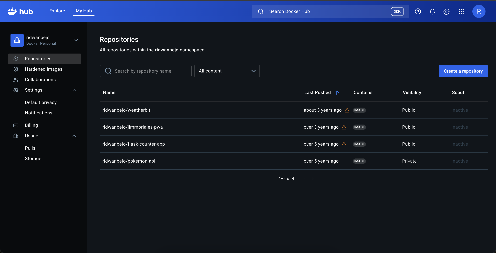
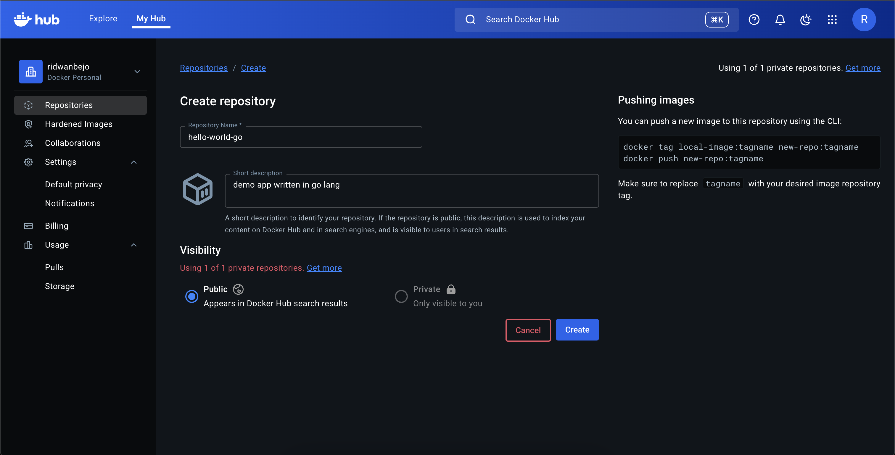
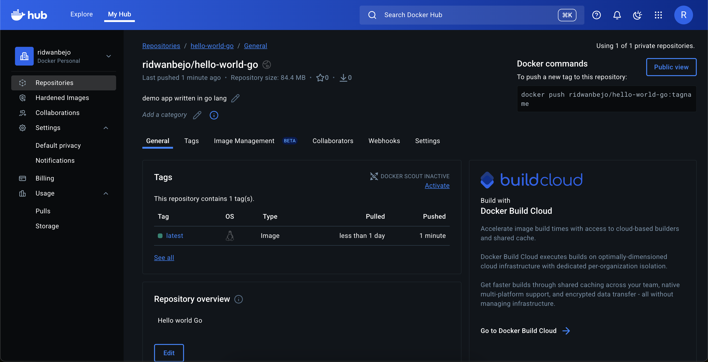
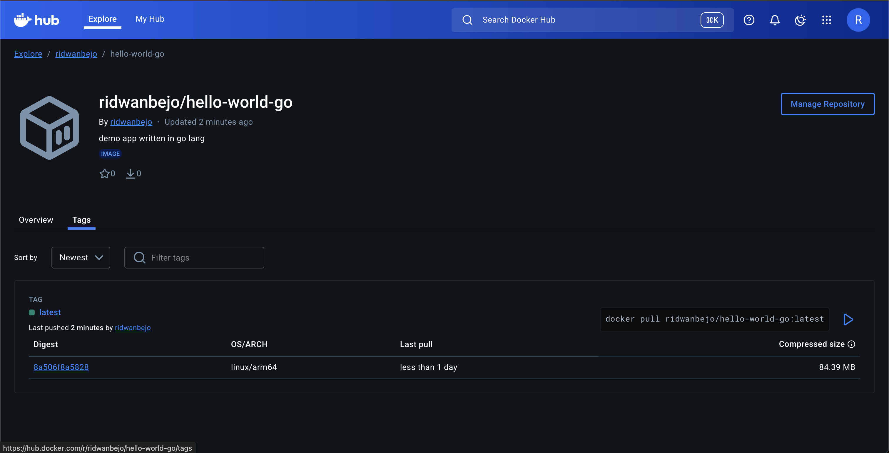

# Docker command examples

> I'm using Ubuntu OS when running these commands.

# A. Prerequisites

1. Ubuntu / Debian installed machine
2. install docker-ce in ubuntu -> [link](https://docs.docker.com/engine/install/ubuntu/)
3. install Go lang -> `sudo apt install golang-go`

# B. Preparing demo app

1. Create new folder which called `demo-app`
2. Let's start by creating demo app with Go (this is not perfect Go lang code, it's just an example)

```
package main

import (
    "fmt"
	"log"
	"net/http"
)

func helloHandler(w http.ResponseWriter, r *http.Request) {
    log.Printf("Received %s request for %s", r.Method, r.URL.Path)
	fmt.Fprintf(w, "Hello world!")
}

func main() {
	log.Println("Server is running on port 8080...")
	http.HandleFunc("/", helloHandler)

	log.Fatal(http.ListenAndServe(":8080", nil))
}
```

3. Save the snippet above on file called main.go
4. Now, create Dockerfile under folder `demo-app`. Then, save this snippet below

```
FROM golang:alpine3.23

RUN apk update

WORKDIR /app

COPY main.go .

RUN go build main.go
RUN chmod +x /app/main

ENTRYPOINT ["/app/main"]
```

5. This is not ideal setup for deploying Go application on production. For now, let make this thing work for demo purpose.

6. login to your Docker account. Specify username and password.

```
sudo docker login -u << your username >>

i Info → A Personal Access Token (PAT) can be used instead.
         To create a PAT, visit https://app.docker.com/settings


Password:

WARNING! Your credentials are stored unencrypted in '/root/.docker/config.json'.
Configure a credential helper to remove this warning. See
https://docs.docker.com/go/credential-store/

Login Succeeded
```

# C. Docker essential commands for this tutorial

1. Build the Docker image

command:

```
sudo docker build . -t hello-world-go:latest
```

Example output:

```
vagrant@vagrant:~/Projects/demo-app$ sudo docker build . -t hello-world-go:latest
[+] Building 1.9s (11/11) FINISHED                                                                                                                                                                     docker:default
 => [internal] load build definition from Dockerfile                                                                                                                                                             0.0s
 => => transferring dockerfile: 179B                                                                                                                                                                             0.0s
 => [internal] load metadata for docker.io/library/golang:alpine3.23                                                                                                                                             1.1s
 => [internal] load .dockerignore                                                                                                                                                                                0.0s
 => => transferring context: 2B                                                                                                                                                                                  0.0s
 => [internal] load build context                                                                                                                                                                                0.0s
 => => transferring context: 29B                                                                                                                                                                                 0.0s
 => [1/6] FROM docker.io/library/golang:alpine3.23@sha256:26111811bc967321e7b6f852e914d14bede324cd1accb7f81811929a6a57fea9                                                                                       0.1s
 => => resolve docker.io/library/golang:alpine3.23@sha256:26111811bc967321e7b6f852e914d14bede324cd1accb7f81811929a6a57fea9                                                                                       0.1s
 => CACHED [2/6] RUN apk update                                                                                                                                                                                  0.0s
 => CACHED [3/6] WORKDIR /app                                                                                                                                                                                    0.0s
 => CACHED [4/6] COPY main.go .                                                                                                                                                                                  0.0s
 => CACHED [5/6] RUN go build main.go                                                                                                                                                                            0.0s
 => CACHED [6/6] RUN chmod +x /app/main                                                                                                                                                                          0.0s
 => exporting to image                                                                                                                                                                                           0.3s
 => => exporting layers                                                                                                                                                                                          0.0s
 => => exporting manifest sha256:a851400addf27dc8df94b1a480e301a3f4aaf6da3cfbe601ff054cc1b711cc55                                                                                                                0.0s
 => => exporting config sha256:f3930e984736e352168343cc8e375bc3ca5f4c978f2e9675acfead700df3741f                                                                                                                  0.0s
 => => exporting attestation manifest sha256:b693a23fdd1411c91315495d3b6179f2b850a9d5e742226bd2d2a142ce41c6bc                                                                                                    0.1s
 => => exporting manifest list sha256:f38b36df20f60a6c3e186efebfc220942f90aee1668b870d9c531a017eb99373                                                                                                           0.0s
 => => naming to docker.io/library/hello-world-go:latest                                                                                                                                                         0.0s
 => => unpacking to docker.io/library/hello-world-go:latest
```

2. Check all Docker images

command: 

```
sudo docker images
```

Example output:

```
vagrant@vagrant:~/Projects/demo-app$ sudo docker images
                                                                                                                                                                                                  i Info →   U  In Use
IMAGE                                                                                  ID             DISK USAGE   CONTENT SIZE   EXTRA
hello-world-go:latest                                                                  f38b36df20f6        446MB         88.5MB
kindest/node@sha256:7416a61b42b1662ca6ca89f02028ac133a309a2a30ba309614e8ec94d976dc5a   7416a61b42b1       1.48GB          441MB
```

3. Running single container

command:

```
sudo docker run -d -p 8080:8080 --name demo hello-world-go:latest
```

Example output:

```
vagrant@vagrant:~/Projects/demo-app$ clear
vagrant@vagrant:~/Projects/demo-app$ sudo docker run -d -p 8080:8080 --name demo hello-world-go:latest
0cfb282f3e7d4fb8987c5f25de977303124db237997000f6727eb45035fe72fd
```

4. Check all running containers

command:

```
sudo docker ps -a
```

Example output:

```
vagrant@vagrant:~/Projects/demo-app$ sudo docker ps -a
CONTAINER ID   IMAGE                   COMMAND       CREATED          STATUS          PORTS                                         NAMES
0cfb282f3e7d   hello-world-go:latest   "/app/main"   16 seconds ago   Up 14 seconds   0.0.0.0:8080->8080/tcp, [::]:8080->8080/tcp   demo
```

5. Check selected container logs

command:

```
sudo docker logs 0cfb282f3e7d
```

`0cfb282f3e7d` is the `CONTAINER ID` from running container you want to choose.

Example output:

```
vagrant@vagrant:~/Projects/demo-app$ sudo docker logs 0cfb282f3e7d
Server is running on port 8080...
```

6. Test the demo app by using cUrl

command:

```
curl http://localhost:8080/
```

Example output:

```
vagrant@vagrant:~/Projects/demo-app$ curl http://localhost:8080/
Hello world!vagrant@vagrant:~/Projects/demo-app$
```

7. Tailing container logs

command:

```
sudo docker logs 0cfb282f3e7d -f
```

`-f` param will let you follow the through logs from selected running container. You only need to invoke cUrl command above several times to see the output.

Example output:

```
vagrant@vagrant:~/Projects/demo-app$ sudo docker logs 0cfb282f3e7d -f
2025/12/07 00:07:03 Server is running on port 8080...
2025/12/07 00:07:19 Received GET request for /
2025/12/07 00:07:19 Received GET request for /
2025/12/07 00:07:20 Received GET request for /
2025/12/07 00:07:20 Received GET request for /
2025/12/07 00:07:21 Received GET request for /
2025/12/07 00:07:21 Received GET request for /
2025/12/07 00:07:22 Received GET request for /
2025/12/07 00:07:22 Received GET request for /
2025/12/07 00:07:23 Received GET request for /
```

8. Delete existing container

command:

```
sudo docker rm 0cfb282f3e7d -f
```

example output:

```
vagrant@vagrant:~/Projects/demo-app$ sudo docker rm 0cfb282f3e7d -f
0cfb282f3e7d
```

9. Delete existing image

command:

```
sudo docker rmi f38b36df20f6 -f
```

example output:

```
vagrant@vagrant:~/Projects/demo-app$ sudo docker rmi f38b36df20f6 -f
Untagged: hello-world-go:latest
Deleted: sha256:f38b36df20f60a6c3e186efebfc220942f90aee1668b870d9c531a017eb99373
```

# D. Push your image to DockerHub

Before we push our Docker image from local machine / server to DockerHub, you must follow these instruction to create DockerHub repository in order to host your Docker image later:

1. Login to your DockerHub. If you don't have the account, please sign up.
2. You will be redirected to your home DockerHub page, e.g.: https://hub.docker.com/repositories/ridwanbejo



3. Hit `Create Repository` button, then you will be redirected to page https://hub.docker.com/repository/create?namespace=<< username >>
4. Specify your new repository name on field `New Repository` and add your description on field `Short Description`. Then, hit `Create` button



5. Voilla! you have successfully create new repository for your Docker image


Now we can continue to push built Docker image in our local machine or server.

1. Tag your Docker image with the created repository name

command:

```
sudo docker tag hello-world-go:latest ridwanbejo/hello-world-go:latest
```

2. now check the tagged image

command:

```
sudo docker images
```

example output:

```
vagrant@vagrant:~/Projects/demo-app$ 

IMAGE                                                                                  ID             DISK USAGE   CONTENT SIZE   EXTRA
hello-world-go:latest                                                                  63f30e2ee181        446MB         88.5MB    U
kindest/node@sha256:7416a61b42b1662ca6ca89f02028ac133a309a2a30ba309614e8ec94d976dc5a   7416a61b42b1       1.48GB          441MB
ridwanbejo/hello-world-go:latest                                                       63f30e2ee181        446MB         88.5MB    U
```

3. push the tagged image. Ensure you have already successfully login to DockerHub

command:

```
sudo docker push hello-world-go:latest
```

example output:

```
vagrant@vagrant:~/Projects/demo-app$ sudo docker push ridwanbejo/hello-world-go:latest
The push refers to repository [docker.io/ridwanbejo/hello-world-go]
2b0562e970c9: Pushing [==============================>                    ]   34.6MB/57.65MB
a703e0e1d01e: Pushed
7d94a2780399: Pushed
580d236e3ad1: Pushed
0bd713040ebb: Pushed
bb58e72b5cd2: Pushed
6575e28bfea9: Pushed
4f4fb700ef54: Pushed
5505fea3824f: Pushed
2c14a2a97420: Pushed
```

after sometime, the output will be like this:

```
vagrant@vagrant:~/Projects/demo-app$ sudo docker push ridwanbejo/hello-world-go:latest
The push refers to repository [docker.io/ridwanbejo/hello-world-go]
2b0562e970c9: Pushed
a703e0e1d01e: Pushed
7d94a2780399: Pushed
580d236e3ad1: Pushed
0bd713040ebb: Pushed
bb58e72b5cd2: Pushed
6575e28bfea9: Pushed
4f4fb700ef54: Pushed
5505fea3824f: Pushed
2c14a2a97420: Pushed
latest: digest: sha256:63f30e2ee181c2e45430cc19cfecbc7b5ffd11aeb1da68a24fdbf10a6a3fb34d size: 856
```

If it's succeed, you can see your image is pushed to targeted repository:








4. Assume hello-world-go image is deleted from your localhost. Then, we will pull image from DockerHub

command:

```
sudo docker pull ridwanbejo/hello-world-go:latest
```

example output:

```
vagrant@vagrant:~/Projects/demo-app$ sudo docker pull ridwanbejo/hello-world-go:latest
latest: Pulling from ridwanbejo/hello-world-go
6575e28bfea9: Download complete
Digest: sha256:63f30e2ee181c2e45430cc19cfecbc7b5ffd11aeb1da68a24fdbf10a6a3fb34d
Status: Downloaded newer image for ridwanbejo/hello-world-go:latest
docker.io/ridwanbejo/hello-world-go:latest
```

5. Check the images now

```
vagrant@vagrant:~/Projects/demo-app$ sudo docker images
                                                                                                                                                                                                  i Info →   U  In Use
IMAGE                                                                                  ID             DISK USAGE   CONTENT SIZE   EXTRA
kindest/node@sha256:7416a61b42b1662ca6ca89f02028ac133a309a2a30ba309614e8ec94d976dc5a   7416a61b42b1       1.48GB          441MB
ridwanbejo/hello-world-go:latest                                                       63f30e2ee181        446MB         88.5MB    U
```